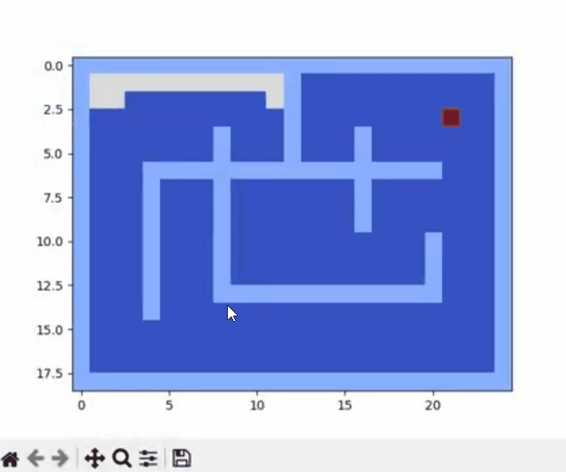

# Maze Pathfinding Algorithms: DFS, BFS, and A* Comparison

This repository compares the DFS, BFS, and A* pathfinding algorithms. Each algorithm is implemented in Python and visualized as it navigates a maze defined in a CSV format.

## Introduction

Pathfinding algorithms are key in navigating grids to find paths from a start to a goal. This project visualizes three classic algorithms:
- **Depth-First Search (DFS)**
- **Breadth-First Search (BFS)**
- **A* Search**

## Maze Representation

The maze is represented in a CSV file with:
- `0`: Free space
- `1`: Wall
- `3`: Start
- `4`: Goal

During exploration:
- `2`: Visited cell

## Algorithms

### Depth-First Search (DFS)
DFS explores as far as possible along each path before backtracking. It’s memory-efficient but may not find the shortest path.

### Breadth-First Search (BFS)
BFS explores all nodes at the current depth before moving deeper, ensuring the shortest path in unweighted grids.

### A* Search
A* combines BFS with heuristics to prioritize nodes closer to the goal, making it efficient and optimal in finding the shortest path.

## Dependencies

Here’s a more concise version of the README without a table of contents:

markdown
Copiar código
# Maze Pathfinding Algorithms: DFS, BFS, and A* Comparison

This repository compares the DFS, BFS, and A* pathfinding algorithms. Each algorithm is implemented in Python and visualized as it navigates a maze defined in a CSV format.

## Introduction

Pathfinding algorithms are key in navigating grids to find paths from a start to a goal. This project visualizes three classic algorithms:
- **Depth-First Search (DFS)**
- **Breadth-First Search (BFS)**
- **A* Search**

## Maze Representation

The maze is represented in a CSV file with:
- `0`: Free space
- `1`: Wall
- `3`: Start
- `4`: Goal

During exploration:
- `2`: Visited cell

## Algorithms

### Depth-First Search (DFS)
DFS explores as far as possible along each path before backtracking. It’s memory-efficient but may not find the shortest path.

### Breadth-First Search (BFS)
BFS explores all nodes at the current depth before moving deeper, ensuring the shortest path in unweighted grids.

### A* Search
A* combines BFS with heuristics to prioritize nodes closer to the goal, making it efficient and optimal in finding the shortest path.

## Usage

1. Define the maze in a CSV file.
2. Run each algorithm’s script in Python.
3. Enter start and goal coordinates when prompted.

## Dependencies

- Python 3.x
- NumPy
- Matplotlib

